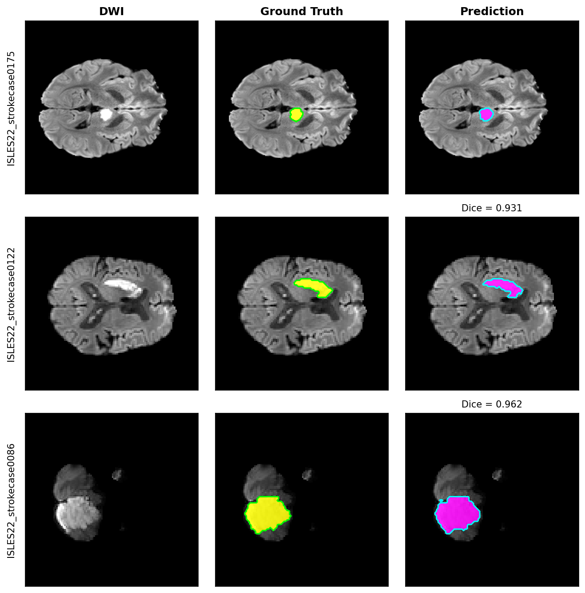
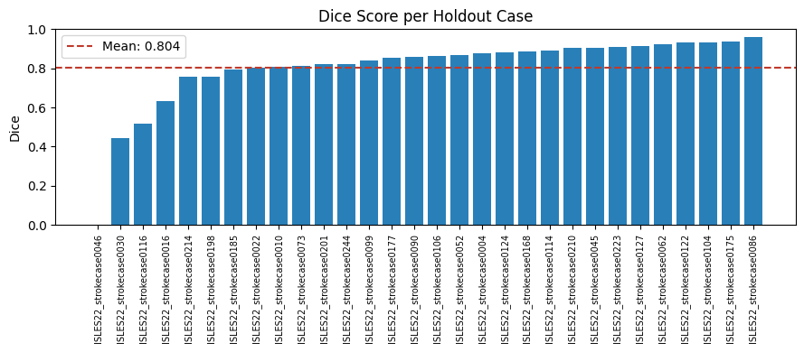
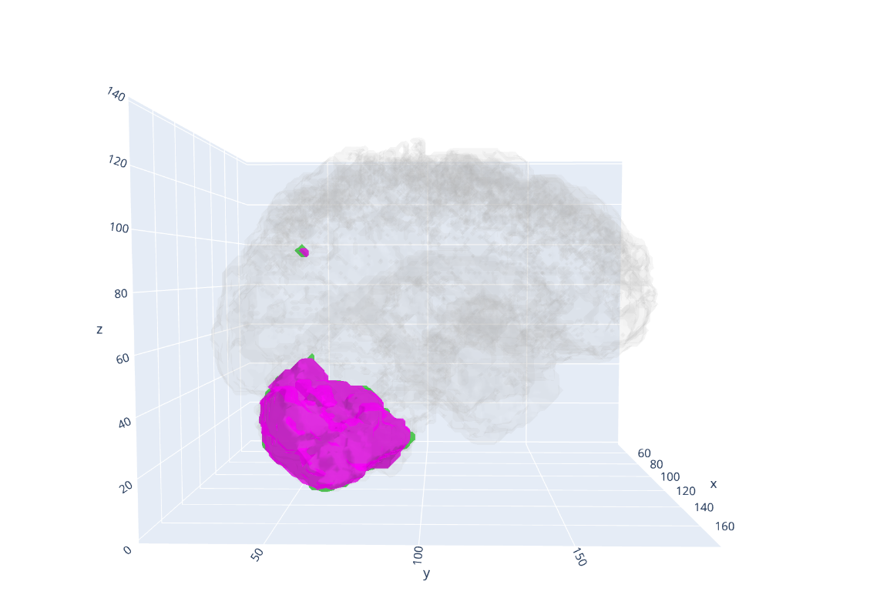
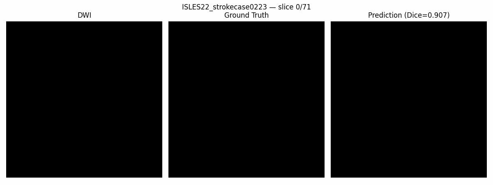
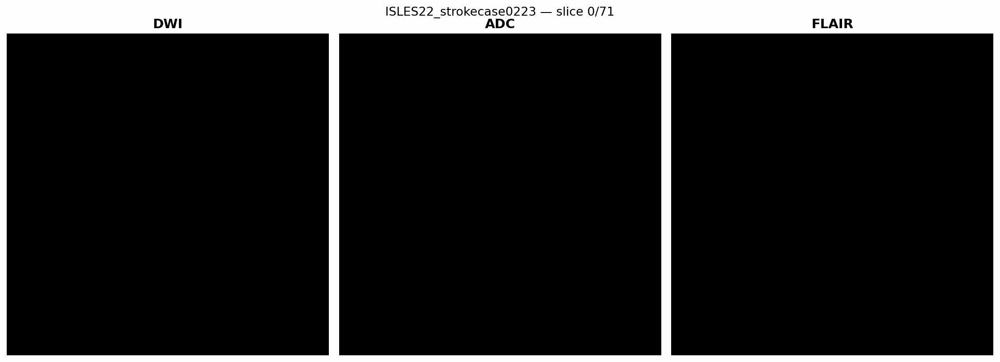

# Ischemic Stroke Lesion Segmentation — ISLES 2022 with nnU-Net v2

End-to-end deep learning pipeline for automated ischemic stroke lesion segmentation from multi-parametric MRI (DWI, ADC, FLAIR), built on the self-configuring [nnU-Net v2](https://github.com/MIC-DKFZ/nnUNet) framework and trained on the [ISLES 2022](https://doi.org/10.5281/zenodo.7153326) challenge dataset.

<p align="center">
  
</p>

<p align="center">
  <em>Ground truth (green) vs. model prediction (magenta) on representative holdout cases — from a barely-visible acute lesion to a large, unmistakable infarct.</em>
</p>

---

## Results

A model is only as convincing as its worst case, not just its best one — so before the headline number, know that both are shown honestly below.

Evaluated on a 30-case holdout, never seen during training (220 cases used for training).

| Metric | Mean | Median |
|---|---|---|
| **Dice** | **0.804** | **0.861** |
| IoU (Jaccard) | 0.702 | 0.756 |
| Sensitivity (Recall) | 0.775 | 0.839 |
| Specificity | 0.999 | 0.9999 |
| Precision | 0.864 | 0.897 |
| Hausdorff95 (mm) | 6.64 | 2.68 |

**Mean Dice: 0.804 — 95% bootstrap CI [0.727, 0.862]** (10,000 resamples, n=30). The relatively wide interval reflects the small holdout size and two clear failure cases (see below); the median (0.861) is a better summary of "typical" performance.

For reference, published results on ISLES 2022 with fully-trained, ensembled models typically fall in the **0.75–0.87** Dice range depending on modality combination and architecture. This result — from a single fold and a reduced-epoch trainer — lands within that range, suggesting headroom for a full 5-fold ensemble trained to convergence.

Best case Dice: **0.962** (`strokecase0086`). Note the large mean/median gap for Hausdorff95 — this is driven almost entirely by two outliers (`strokecase0030`: 66.5 mm, `strokecase0046`: 35.7 mm), the same two cases that also score lowest on Dice (see [Failure Cases](#failure-cases)).

<details>
<summary><b>Full per-case metrics table</b> (click to expand)</summary>

| Case | Dice | IoU | Sensitivity | Specificity | Precision | HD95 (mm) |
|---|---|---|---|---|---|---|
| strokecase0086 | 0.962 | 0.926 | 0.956 | 0.9998 | 0.967 | 2.00 |
| strokecase0175 | 0.938 | 0.884 | 0.950 | 0.9999 | 0.927 | 1.15 |
| strokecase0104 | 0.932 | 0.872 | 0.922 | 0.9994 | 0.942 | 2.83 |
| strokecase0122 | 0.931 | 0.871 | 0.900 | 0.9999 | 0.964 | 2.00 |
| strokecase0062 | 0.923 | 0.858 | 0.965 | 0.9965 | 0.885 | 3.46 |
| strokecase0114 | 0.890 | 0.802 | 0.973 | 0.9998 | 0.820 | 2.00 |
| strokecase0168 | 0.887 | 0.797 | 0.870 | 0.9996 | 0.906 | 3.46 |
| strokecase0124 | 0.881 | 0.787 | 0.833 | 0.9999 | 0.935 | 2.00 |
| strokecase0004 | 0.878 | 0.782 | 0.829 | 0.9999 | 0.932 | 2.00 |
| strokecase0223 | 0.907 | 0.830 | 0.865 | 0.9992 | 0.954 | 4.47 |
| strokecase0210 | 0.905 | 0.826 | 0.915 | 0.9996 | 0.895 | 1.80 |
| strokecase0045 | 0.906 | 0.828 | 0.854 | 0.9999 | 0.965 | 2.00 |
| strokecase0127 | 0.915 | 0.844 | 0.978 | 0.9968 | 0.860 | 4.47 |
| strokecase0106 | 0.863 | 0.759 | 0.779 | 0.9999 | 0.968 | 2.00 |
| strokecase0090 | 0.859 | 0.754 | 0.814 | 0.9999 | 0.911 | 2.00 |
| strokecase0052 | 0.869 | 0.768 | 0.845 | 0.9998 | 0.894 | 2.83 |
| strokecase0177 | 0.853 | 0.744 | 0.829 | 0.9999 | 0.879 | 2.00 |
| strokecase0099 | 0.841 | 0.726 | 0.869 | 0.9999 | 0.815 | 2.00 |
| strokecase0244 | 0.822 | 0.698 | 0.759 | 0.9996 | 0.898 | 2.83 |
| strokecase0201 | 0.821 | 0.696 | 0.961 | 0.9921 | 0.716 | 8.58 |
| strokecase0073 | 0.814 | 0.687 | 0.754 | 0.9999 | 0.886 | 10.00 |
| strokecase0022 | 0.804 | 0.673 | 0.693 | 0.9999 | 0.958 | 2.00 |
| strokecase0010 | 0.808 | 0.678 | 0.755 | 0.9999 | 0.869 | 2.83 |
| strokecase0185 | 0.793 | 0.656 | 0.926 | 0.9999 | 0.693 | 1.15 |
| strokecase0198 | 0.759 | 0.612 | 0.624 | 0.9999 | 0.969 | 2.54 |
| strokecase0214 | 0.757 | 0.609 | 0.674 | 0.9999 | 0.863 | 8.94 |
| strokecase0016 | 0.634 | 0.464 | 0.500 | 0.9999 | 0.867 | 2.89 |
| strokecase0116 | 0.518 | 0.350 | 0.360 | 0.9994 | 0.924 | 10.77 |
| strokecase0030 | 0.442 | 0.284 | 0.297 | 0.9999 | 0.864 | 66.50 |
| strokecase0046 | 0.000 | 0.000 | 0.000 | 0.9999 | 0.000 | 35.72 |

</details>

### Failure Cases

Two cases pull both the mean Dice and mean HD95 noticeably below the median: `strokecase0046` (Dice = 0.000 — the model produced no detectable overlap with the ground truth lesion) and `strokecase0030` (Dice = 0.442, HD95 = 66.5 mm). These are flagged here rather than smoothed over, since a handful of unreliable predictions is an expected and clinically-relevant property of a single-fold, reduced-epoch model — not something to hide behind an aggregate number.

<p align="center">
  
</p>

### 3D Visualization

An interactive 3D rendering of ground truth vs. predicted lesion volume (best-performing case) is available at [`assets/isles22_3d_lesion.html`](assets/isles22_3d_lesion.html) — download and open it in a browser to rotate/zoom.

<p align="center">
  
</p>

### Slice-by-Slice Prediction Animation

<p align="center">
  
</p>

<p align="center">
  <em>Slice-by-slice animation comparing ground truth lesion annotations with model predictions across the complete volume.</em>
</p>

---

## Dataset

[ISLES 2022](https://doi.org/10.5281/zenodo.7153326) (Hernandez Petzsche et al., 2022) is a multi-center, expert-annotated MRI dataset for ischemic stroke lesion segmentation, released as the training set for the ISLES'22 MICCAI challenge.

| | |
|---|---|
| Cases | 250 (this project: 220 train / 30 held out) |
| Modalities | DWI (b=1000), ADC, FLAIR |
| Format | NIfTI, BIDS-inspired layout |
| Centers | 3 (Munich, Bern, Hamburg) |
| Annotation | Expert-drawn, radiologist-verified |
| License | CC BY 4.0 |

The dataset is **not included in this repository** (per its license terms and size). Download it directly from Zenodo:

```bash
wget https://zenodo.org/records/7153326/files/ISLES-2022.zip
```

---

## Why Three Sequences?

A single MRI sequence rarely tells the whole story of a stroke. **DWI** lights up acutely restricted diffusion — the sharpest signal for a fresh infarct, but at a native resolution as low as 112×112. **ADC** confirms that signal quantitatively, ruling out T2 shine-through artifacts. **FLAIR**, slower to change but anatomically richer, adds context DWI alone can miss. Feeding all three into the network — rather than picking one — is exactly why the reported Dice sits at the upper end of the literature range instead of the lower one.

<p align="center">
  
</p>

<p align="center">
  <em>All three input channels, slice by slice, for a representative case.</em>
</p>

---

## Method

1. **Data discovery** — automatic detection of the BIDS-style `sub-strokecaseXXXX/ses-0001/` layout and the corresponding `derivatives/` lesion masks.
2. **Preprocessing** — ADC and FLAIR are resampled onto the DWI grid (SimpleITK, linear interpolation) to form a spatially-consistent 3-channel input. *Note: this is a grid resample, not a full rigid/affine registration — see [Limitations](#limitations).*
3. **nnU-Net conversion** — cases are converted to the standard `imagesTr`/`labelsTr` + `dataset.json` format, with `channel_names = {DWI, ADC, FLAIR}`.
4. **Training** — nnU-Net v2's self-configuring pipeline plans and trains a `3d_fullres` U-Net (single fold) via `nnUNetv2_train`.
5. **Inference & evaluation** — predictions are generated on a held-out split (30 cases, never seen during training) and scored with Dice, IoU, sensitivity, specificity, precision, and Hausdorff95.

```
Raw MRI (DWI/ADC/FLAIR + mask)
        │
        ▼
  Data discovery & QC  ──►  Resample to common grid
        │
        ▼
  nnU-Net raw dataset (imagesTr / labelsTr / dataset.json)
        │
        ▼
  nnUNetv2_plan_and_preprocess
        │
        ▼
  nnUNetv2_train (3d_fullres, fold 0)
        │
        ▼
  nnUNetv2_predict  ──►  Metric evaluation  ──►  Qualitative & 3D visualization
```

---

## Repository Structure

```
.
├── README.md
├── requirements.txt
├── LICENSE
├── notebooks/
│   └── isles22_eda_train_inference.ipynb    # full pipeline, run top-to-bottom in Colab
├── scripts/
│   ├── predict.py                           # standalone CLI inference on a new case
│   └── evaluate.py                          # standalone CLI Dice / IoU / HD95 evaluation
└── assets/
    ├── isles22_prediction_example.png       # showcase: GT vs. prediction, multiple cases
    ├── dice_distribution.png                # per-case Dice bar chart
    ├── 3d_lesion_preview.png                # static screenshot of the 3D plot
    ├── isles22_3d_lesion.html               # interactive 3D lesion viewer
    ├── sequences_demo.gif                   # DWI / ADC / FLAIR side-by-side, all slices
    └── prediction_demo.gif                  # GT vs. prediction overlay, all slices
```

---

## Reproducing This

The full pipeline is contained in a single, self-contained Colab notebook: [`notebooks/isles22_eda_train_inference.ipynb`](notebooks/isles22_eda_train_inference.ipynb).

1. Download the ISLES 2022 dataset from Zenodo and upload it to Google Drive.
2. Open the notebook in Colab, adjust `DATASET_ROOT` to your Drive path.
3. Run all cells sequentially: EDA → data conversion → preprocessing → training → inference → evaluation.

**Hardware:** trained on a single Colab GPU (T4/A100 class). Training the `3d_fullres` configuration for `nnUNetTrainer_250epochs` (single fold) takes roughly a few hours; checkpoints are written directly to Drive so interrupted sessions can resume with `--c`.

```bash
pip install -r requirements.txt
```

### Running Inference on a New Case (CLI)

Pre-trained model weights (`checkpoint_best.pth` and `checkpoint_latest.pth`) can be accessed via this Google Drive link:
- 🔗 **[Download Model Weights (Google Drive)](https://drive.google.com/drive/folders/13dxxltUTQNV3y5zx72-D6gnd6zfnxqrB?usp=sharing)**

Beyond the notebook, `scripts/predict.py` wraps the trained model for standalone use — no notebook required:

```bash
python scripts/predict.py \
    --dwi path/to/case_dwi.nii.gz \
    --adc path/to/case_adc.nii.gz \
    --flair path/to/case_flair.nii.gz \
    --output path/to/output_dir \
    --checkpoint path/to/nnUNet_results
```

Evaluate a prediction against a ground truth mask:

```bash
python scripts/evaluate.py \
    --prediction path/to/prediction.nii.gz \
    --ground-truth path/to/ground_truth.nii.gz
```

---

## Limitations

- **FLAIR alignment:** FLAIR is resampled onto the DWI grid but not rigidly registered to it. The dataset authors note that released sequences are in native space; a proper affine/rigid registration step (e.g. with ANTsPy or Elastix) would likely improve the FLAIR channel's contribution.
- **Single fold, reduced-epoch trainer:** results use `nnUNetTrainer_250epochs` and fold 0 only, for tractable Colab training times. A full `nnUNetTrainer` (1000 epochs) with 5-fold ensembling is expected to improve Dice further and reduce the variance seen in the failure cases above.
- **Internal holdout, not the official test set:** ISLES'22's official test-set masks are not public; the 30-case holdout here is carved out of the public 250-case training release. Reported numbers are not directly comparable to the official challenge leaderboard.
- **Two clear failure cases** (`strokecase0046`, `strokecase0030`) were not further investigated (e.g. registration QC, lesion size check) — this is a natural next step before treating the model as reliable across the full case distribution.

---

## Citation

If you use this code, please cite the dataset and the nnU-Net framework it builds on:

```bibtex
@article{hernandez2022isles,
  title   = {ISLES 2022: A multi-center magnetic resonance imaging stroke lesion segmentation dataset},
  author  = {Hernandez Petzsche, Moritz R. and de la Rosa, Ezequiel and Hanning, Uta and others},
  journal = {Scientific Data},
  volume  = {9},
  pages   = {762},
  year    = {2022},
  doi     = {10.1038/s41597-022-01875-5}
}

@article{isensee2021nnunet,
  title   = {nnU-Net: a self-configuring method for deep learning-based biomedical image segmentation},
  author  = {Isensee, Fabian and Jaeger, Paul F. and Kohl, Simon A. A. and Petersen, Jens and Maier-Hein, Klaus H.},
  journal = {Nature Methods},
  volume  = {18},
  number  = {2},
  pages   = {203--211},
  year    = {2021}
}
```

## Author & License

Developed by **Mehmet Akif Karadağ**.

Code in this repository is released under the [MIT License](LICENSE). The ISLES 2022 dataset itself is released separately under **CC BY 4.0** by its original authors — see the [Zenodo record](https://doi.org/10.5281/zenodo.7153326) for full terms.
